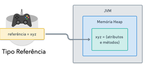
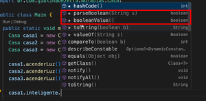

---

<div class="my-6 rounded-r-lg border-l-4 border-primary bg-muted/50 p-4 shadow-sm dark:bg-muted/10">
  <div class="mb-2 flex items-center gap-2">
    <svg xmlns="http://www.w3.org/2000/svg" width="20" height="20" viewBox="0 0 24 24" fill="none" stroke="currentColor" stroke-width="2" stroke-linecap="round" stroke-linejoin="round" class="text-primary"><circle cx="12" cy="12" r="10"/><line x1="12" x2="12" y1="8" y2="12"/><line x1="12" x2="12.01" y1="16" y2="16"/></svg>
    <span class="text-lg font-bold text-primary">Disclaimer</span>
  </div>
  <p class="text-muted-foreground text-sm leading-relaxed">
    O conteúdo desse estudo foi feito durante o <strong>Curso de Desenvolvimento Java</strong>, lecionado pela Giuliana Silva Bezerra.
  </p>
  <p class="mt-2 text-muted-foreground text-sm leading-relaxed">
    Aconselho veemente que você utilize este material como um <em>complemento</em> ao curso, e não como substituto do mesmo.
    A didática dela é incrível e você aprenderá muito mais seguindo o curso oficial.
  </p>
  <div class="mt-4 flex flex-col gap-3 sm:flex-row">
    <a href="https://www.udemy.com/course/curso-de-desenvolvimento-java/" target="_blank" class="inline-flex items-center gap-1 font-medium text-primary hover:underline">
      <svg xmlns="http://www.w3.org/2000/svg" width="14" height="14" viewBox="0 0 24 24" fill="none" stroke="currentColor" stroke-width="2" stroke-linecap="round" stroke-linejoin="round"><path d="M18 13v6a2 2 0 0 1-2 2H5a2 2 0 0 1-2-2V8a2 2 0 0 1 2-2h6"/><polyline points="15 3 21 3 21 9"/><line x1="10" y1="14" x2="21" y2="3"/></svg>
      Curso Oficial (Udemy)
    </a>
    <a href="https://www.youtube.com/@giulianabezerra" target="_blank" class="inline-flex items-center gap-1 font-medium text-primary hover:underline">
      <svg xmlns="http://www.w3.org/2000/svg" width="14" height="14" viewBox="0 0 24 24" fill="none" stroke="currentColor" stroke-width="2" stroke-linecap="round" stroke-linejoin="round"><path d="M22.54 6.42a2.78 2.78 0 0 0-1.94-2C18.88 4 12 4 12 4s-6.88 0-8.6.46a2.78 2.78 0 0 0-1.94 2A29 29 0 0 0 1 11.75a29 29 0 0 0 .46 5.33A2.78 2.78 0 0 0 3.4 19c1.72.46 8.6.46 8.6.46s6.88 0 8.6-.46a2.78 2.78 0 0 0 1.94-2 29 29 0 0 0 .46-5.33 29 29 0 0 0-.46-5.33z"/><polygon points="9.75 15.02 15.5 11.75 9.75 8.48 9.75 15.02"/></svg>
      Canal Giu Bezerra
    </a>
  </div>
</div>

## Introdução

A Programação Orientada a Objetos (POO) é um paradigma de programação que utiliza "objetos" para representar dados e funcionalidades.

Em Java, a POO é amplamente utilizada devido à sua capacidade de organizar o código de forma modular, facilitando a manutenção e a reutilização.

Nós podemos criar um objeto, para que ele tenha características (atributos) e comportamentos (métodos), podendo fazer
diversas operações. Este objeto, poderá ser reutilizado em outras partes do código, outras classes, etc.

## Vantagens da POO

- **Modularidade**: O código é dividido em objetos, facilitando a organização e a manutenção.
- **Reutilização**: Objetos podem ser reutilizados em diferentes partes do código ou em outros projetos.
- **Facilidade de manutenção**: Alterações em um objeto não afetam outras partes do código.
- **Abstração**: Permite representar conceitos do mundo real de forma mais intuitiva
- **Encapsulamento**: Protege os dados internos dos objetos, permitindo acesso controlado.


## Classes e Objetos

Classes representam conceitos, coisas do mundo real: Usuário, Produto, Compra, Carrinho, uma Calculadora, etc.

### Classe X Objeto

- **Classe**: É um molde ou uma planta que define as características e comportamentos de um objeto.
- **Objeto**: É uma instância concreta de uma classe, com valores específicos para seus atributos.

Por exemplo, uma Classe específica pode ser uma planta de uma casa. E com essa planta, construiremos VÁRIAS casas. E as casas, neste contexto, são os objetos.


### Atributos

**O que a Classe tem? Quais são suas características? O que ela pode fazer?**

Classes possuem atributos, ou seja, características dela. Já que estamos no conceito de Planta/Casa... Uma casa pode ter
uma sala, quarto, cozinha ou banheiro. Isso são características dela (atributos).


Numa classe Compra, por exemplo, que tipo de atributos poderíamos ter? Poderíamos ter atributos de nome do produto, valor, quantidade e por aí vai.

```java
public class Compra {
    String nomeProduto;
    double valor;
    int quantidade;
}
```

E um Usuário?

```java
public class Usuario {
    String nome;
    String email;
    String senha;
}
```

### Métodos

**Ok, e como definimos o que essa Classe irá fazer?**

Métodos são operações, funções. Ainda no exemplo de casa, uma casa terá que acender a luz, trancar a porta, ativar alarme.... isso serão métodos dentro da Classe.


Uma Casa, por exemplo, pode ser uma casa inteligente, com comandos de voz. Podemos criar um atributo boolean para identificar isso dentro de um método.

```java
public class Casa {
    boolean casaInteligente;

    public void acenderLuz() {
        if (casaInteligente) {
            System.out.println("Luz acesa via comando de voz!");
        } else {
            System.out.println("Luz acesa manualmente.");
        }
    }
}
```

Os métodos podem retornar qualquer coisa. Se fosse um "int" ao invés de void acima, teríamos que colocar para ele retornar um inteiro no final da função.

Além disso, dentro dos (), podemos passar parâmetros para o método ler. Exemplo, podemos colocar qual parte da casa ele irá acender a luz colocando (int comodo).

```java
public class Casa {
    boolean casaInteligente;

    public void acenderLuz(int comodo) {
        if (casaInteligente) {
            System.out.println("Luz do cômodo " + comodo + " acesa via comando de voz!");
        } else {
            System.out.println("Luz do cômodo " + comodo + " acesa manualmente.");
        }
    }
}
```

## Construtores

Construtores são métodos especiais usados para criar objetos de uma classe. Eles inicializam os atributos do objeto quando ele é criado.

### Padrão

Um construtor padrão não recebe parâmetros e inicializa os atributos com valores padrão.

```java
public class Usuario {
    String nome;
    String email;
    String senha;
    // Construtor padrão
    public Usuario() {
        this.nome = "Nome Padrão";
        this.email = "Email Padrão";
        this.senha = "Senha Padrão";
    }
}
```

### Com parâmetros

Um construtor com parâmetros permite inicializar os atributos com valores específicos ao criar o objeto.

```java
public class Main {
    public static void main(String[] args) {
        // Criando um objeto Usuario usando o construtor com parâmetros
        Usuario usuario1 = new Usuario("usuario", "usuario@gmail.com", "senha123");
        System.out.println("Nome: " + usuario1.nome);
        System.out.println("Email: " + usuario1.email);
    }
}

public class Usuario {
    String nome;
    String email;
    String senha;
    // Construtor
    public Usuario(String nome, String email, String senha) {
        this.nome = nome;
        this.email = email;
        this.senha = senha;
    }
}
```

## Atributos

Os atributos nos objetos são inicializados com valores default. Um boolean, por exemplo, sempre irá iniciar false, uma String null e por aí vai.

Então a ideia é a partir de agora é: inicializarmos esses atributos. Declarou no objeto? Informe os valores.

### Membros Públicos

A forma mais simples de inicializar atributos é deixando eles públicos e atribuindo valores diretamente.

Se não há nenhuma declaração, não é possível acessá-los de outras Classes.

Public - Qualquer pessoa/classe pode acessar, torna a classe visível para quem está fora do pacote. Então agora, os métodos e atributos serão public, podendo ser acessados.

```java
public class Usuario {
    public String nome;
    public String email;
}
```

## Pacotes

Pacotes são usados para organizar classes relacionadas em grupos. Eles ajudam a evitar conflitos de nomes e facilitam a manutenção do código.

```java
package com.exemplo.meupacote;
public class MinhaClasse {
    // código da classe
}
```

Cada "." é uma divisão ou "/", de pasta. Então "com.exemplo.meupacote" seria a pasta "meupacote", dentro da pasta "exemplo", dentro da pasta "com".

## Tipos de Referência

Temos dois tipos de referência em Java: tipos primitivos e referência.

| Primitivo                                                                                                         | Referência                                                                                  |
| ----------------------------------------------------------------------------------------------------------------- | ------------------------------------------------------------------------------------------- |
| Pré definidos, simples de criar, inicializar e manter.<br/>Variável armazena diretamente seu valor (tamanho fixo) | Criados a partir de classes. É armazenada uma referência para seu valor (tamanho variável). |

**Qual a referência armazenada?**

Em tipos de referência, a variável armazena o endereço de memória onde o objeto está localizado, não o objeto em si.

| String  | Array  |
| ------- | ------ |
| Scanner | Custom |

**E qual a diferença entre eles?**

Eles possuem estados e comportamentos definidos por classes.

### Primitivos

Tipos primitivos são os tipos de dados mais básicos em Java. Eles armazenam valores simples diretamente na memória.


### Referência

Podemos ter vários atributos e métodos associados a este valor.



#### Exemplos

Vamos pensar numa classe Café.

```java
public class Cafe {
    String tipo;

    void tomarCafe() {
        System.out.printf("Hmmm!");
    }
}
```

Como essa classe foi criado, ela pode ser instanciada agora:

```java
Cafe cafe;
```

A variável é chamada cafe com o tipo de referência Cafe, mas como não foi instanciada ou atributo algum valor, ela está nula.
Não terá nenhuma referência, nenhum espaço na JVM.

Então agora, precisamos ir para a **instância**.

```java
Cafe cafe = new Cafe();
cafe.tipo = "Expresso";
cafe.tomarCafe();
```

Assim, utilizamos o construtor padrão (sem parâmetros) para criar um novo objeto da classe Cafe e atribuí-lo à variável cafe.

## Wrapper Classes

|---------|-----------|
| Byte | Short |
| Integer | Long |
| Float | Double |  
| Boolean | Character |

Ao invés de declararmos: private int idade usaremos o tipo wrapper: private Integer idade

A partir do momento que utilizamos wrapper classes poderemos usar métodos desses tipos.



A partir de agora, não teremos mais um valor default. Precisaremos sempre inicializar esse objeto ao declará-lo.

## Static

O modificador static em Java é usado para definir membros (atributos e métodos) que pertencem à classe em si, e não a instâncias específicas da classe.

Ou seja, criamos membros que não dependem de objetos.

### Static - Método

Imagine que a gente tenha uma classe Matematica, e dentro dela um método para somar dois números.

```java
public class Matematica {
     public Double somar(Double a, Double b) {
        return a + b;
     }
}
```

Inicialmente, teriamos que instanciar o objeto Matematica para usar o método somar:

```java
Double soma = new Matematica().somar(5.0, 3.0);
System.out.println("Soma: " + soma);
```

Mas, se fizermos o método somar como static, podemos chamá-lo diretamente pela classe, sem precisar criar um objeto:

```java
public class Matematica {
     public static Double somar(Double a, Double b) {
        return a + b;
     }
}

Double soma = Matematica.somar(5.0, 3.0);
System.out.println("Soma: " + soma);
```

### Static - Atributo

Vamos supor que a nossa classe Matematica, tem um limite de resultado na soma:

```java
public class Matematica {
    public Double limite = 100.0;

    public static Double soma(double n1, double n2) {
        double soma = n1 + n2;
        if (soma > limite) {   // ERRO
            return limite;
        } else return soma;
    }
}
```

**Conforme visto acima, isso dá um erro, por quê?** Porque o atributo limite não é static, e o método somar é static. Então,
o método somar não consegue acessar o atributo limite.

Vimos que métodos estáticos não dependem de instâncias. Então se não existe nenhuma instancia da classe Matematica criada, não será possivel acessar também, seus atributos.
Esse atributo "limite", será estático. E existirá independente da classe Matematica ter sido instanciada ou não. E será possível utilizá-lo.

Portanto, métodos estáticos só acessam métodos/atributos estáticos.

Por sua vez, metodos não estáticos, podem acessar estáticos.

Forma correta:

```java
public class Matematica {
    public static Double limite = 100.0;

    public static Double soma(double n1, double n2) {
        double soma = n1 + n2;
        if (soma > limite) {
            return limite;
        }
        return soma;
    }
}
```

### Quando usar Static e Final?

O valor limite declarado acima, por mais que seja estático, pode acabar sendo utilizado num método não estático
tendo o seu valor inicial alterado. Para não ser possível redefinir o seu valor, passamos "final", no mesmo. Além diso, é comum variáveis do tipo final ter SNAKE_CASE.

Essa variável ficaria, portanto: `public static final Double LIMITE_OPERACAO = 100.0`

O Static também pode ser utilizado em classes utilitárias. Classes utilitárias são úteis porém o ideal é sempre depender da instanciação do objeto.

### Bloco Static

Blocos estáticos são usados para inicializar variáveis estáticas ou executar código que precisa ser executado apenas uma vez, quando a classe é carregada pela primeira vez.

```java
public class Exemplo {
    public static int valor;
    static {
        valor = 10;
        System.out.println("Bloco estático executado. Valor inicializado para: " + valor);
    }
}
```
